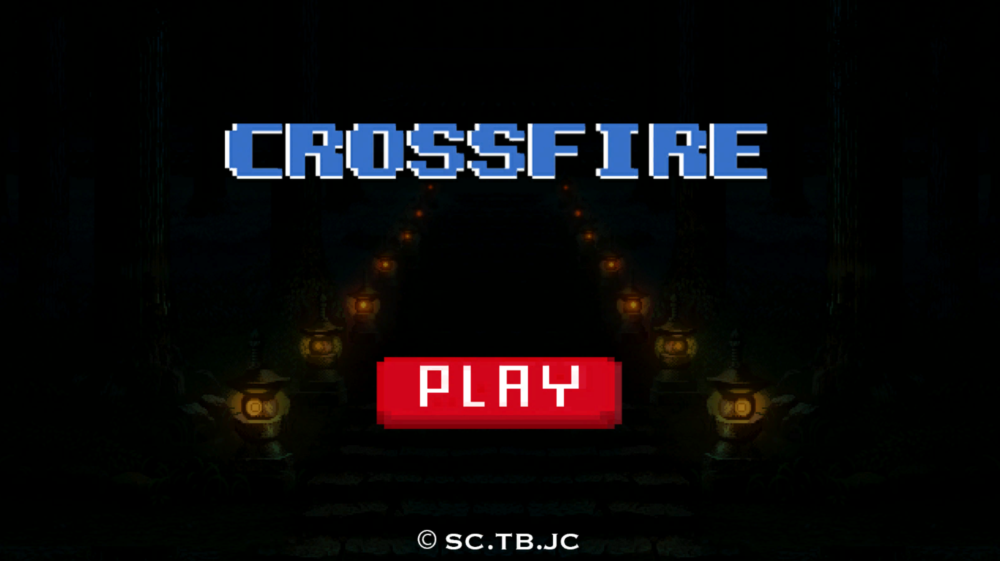
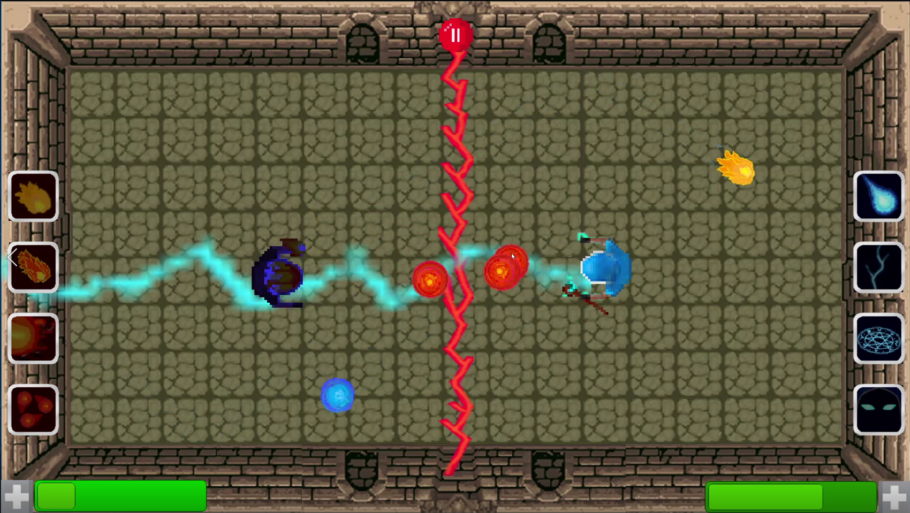

This game is the result of a 5 week group project in school. It is inspired by [Spellcasters Multiplayer Duel](https://play.google.com/store/apps/details?id=com.Tk_Games.Spellcasters). The game is made with Unity and written in C#. To run the game you need a keyboard with a numb block and you need to clone the payable-version branch and execute the crossfire.exe in the Crossfire1.0 folder.
## Controls

<Tabel>

 <table style="width:100%">
  <tr>
    <th>Controls</th>
    <th>Screenshots</th>
  </tr>
  <tr>
    <td>
      
    </td>
    <td>
     

      

        
      

        

          
        

      
 
    </td>
  </tr>
</table> 
